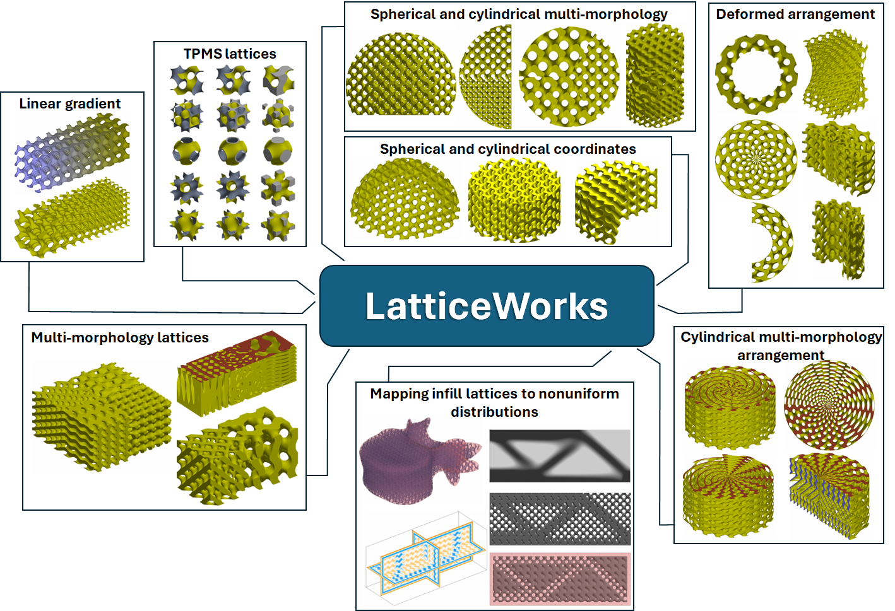

---
title: 'LatticeWorks'
tags:
  - Matlab
  - lattice
  - TPMS
  - functionally graded lattice
  - multi-morphology
authors:
  - name: Mahtab Vafaeefar
    orcid: 0000-0002-0475-8586
    corresponding: true # (This is how to denote the corresponding author)
    affiliation: "1" # (Multiple affiliations must be quoted)
  - name: Kevin M. Moerman
    orcid: 0000-0003-3768-4269
    affiliation: "1, 2"
  - name: Ted J. Vaughan
    orcid: 0000-0002-2219-7620
	affiliation: 1
affiliations:
 - name: Biomechanics Research Centre (BMEC), Schoole of Engineering, College of Science and Engineerig, University of Galway, Ireland
   index: 1
 - name: Griffifth University, Gold Coast, Australia
   index: 2
date: 28 August 2024
bibliography: paper.bib

# Summary

[LatticeWorks](https://github.com/mahtab-vafaee/LatticeWorks) is a MMATLAB toolbox for creating and customizing lattice structures, multi-morphology lattices, and lattices in different coordinates and arrangements. 

{ width=40% }

LatticeWorks toolbox can be used for a variety of applications, such as: 

* **A variety of lattice generation methods for tissue engineering and scaffolds, biomedical devices, energy absorption, etc.
* **Mapping optimised nonuniform gradient lattices on distributed structural and mechanical properties, e.g. stiffness.
* **Creat infill lattice structures within a closed surface, using different lattice types.
* **Finite element analysis (FEA) using ABAQUS directly in the toolbox, as well as post-processingthe results.
* **Generating ready-to-print STL files for 3D printing of lattices.

# Statement of need

Rapid advancement of additive manufacturing technology has expanded the design envelope for sophisticated lightweight lattice structures `[dong2022]`. Due to their highly tunable and multifunctional nature of functionally graded lattice structures, they are used extensively in different applications from biomedical to aerospace engineering `[@Perez2022; @veloso2022]`. In biomedical applications these structures are used as bone implants and scaffolds `[@vafaeefar2023; @Naghavi2023, @zadpoor2019]`. In aerospace Lattice structures are frequently utilized in the aerospace industry along with topology optimization to provide lightweight designs `[@veloso2022]`. Lattice structures are also used for energy absorption applications `[@vafaeefar2024]`.

Given the current significance and potential of functionally graded lattice structures for many applications, identifying techniques and tools that can control lattice geometries to construct functional gradients, and multi-morphology lattices, in different configurations is the main objective of this work. 

# Acknowledgements

This project has received funding from the European Research Council (ERC) under the EU’s Horizon 2020 research and innovation program (Grant agreement No. 804108). This project has also received funding from the European Union’s Horizon Europe research and innovation programme under grant agreement No 101047008 (BIOMET4D). 

# References
        